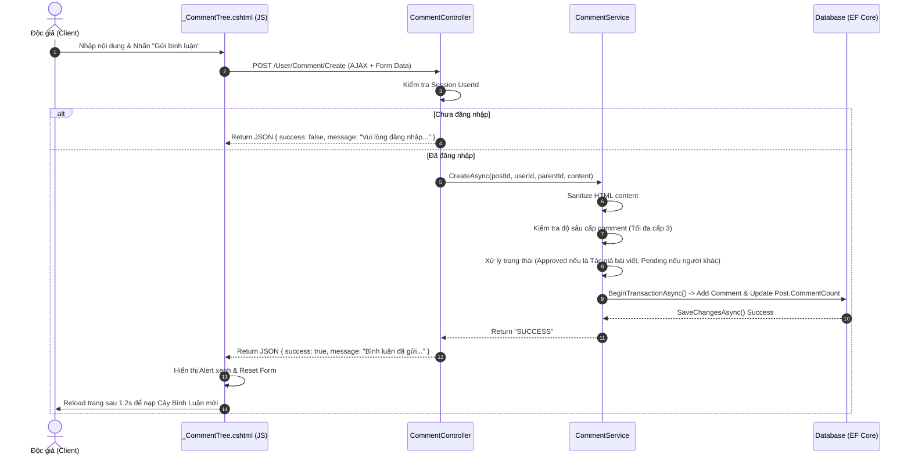
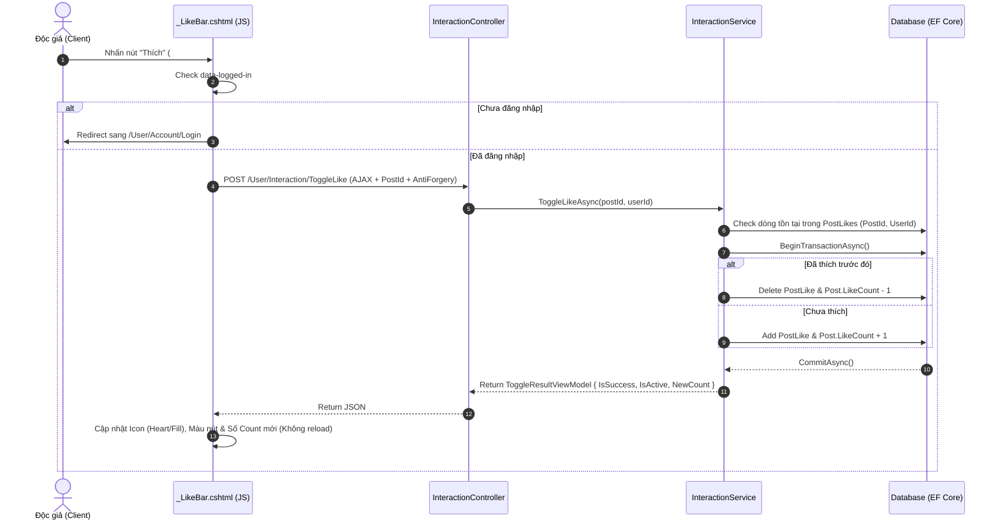
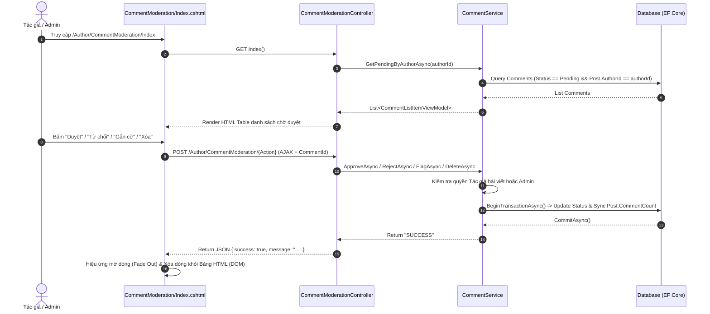

# BÁO CÁO CHI TIẾT LUỒNG TƯƠNG TÁC VÀ XỬ LÝ DỮ LIỆU KHU D (EDU_GROUP_2)

> **Phạm vi Khu D:** Tương tác người dùng (User Interactions)  
> **Công nghệ áp dụng:** ASP.NET Core MVC (.NET 10), EF Core, jQuery AJAX / Fetch API, Bootstrap 5.

---

## 1. TỔNG QUAN VỀ KHU D & DANH SÁCH THÀNH PHẦN SỞ HỮU

Khu D đảm nhận toàn bộ nghiệp vụ tương tác giữa Độc giả / Tác giả với bài viết và bình luận trên hệ thống, bao gồm 3 nhóm tính năng lớn (Issue #7, Issue #8, Issue #9).

### 📁 Các Controller thuộc Khu D:
- [CommentController.cs](file:///d:/T3.2503.E1/ACMF/1.ACMF/edunet/Edu_Group_2/Areas/User/Controllers/CommentController.cs) (Area `User`): Tiếp nhận yêu cầu gửi bình luận và trả lời lồng nhau.
- [InteractionController.cs](file:///d:/T3.2503.E1/ACMF/1.ACMF/edunet/Edu_Group_2/Areas/User/Controllers/InteractionController.cs) (Area `User`): Tiếp nhận yêu cầu Thích (Like), Lưu bài (Bookmark) và hiển thị trang danh sách bài viết đã lưu.
- [CommentModerationController.cs](file:///d:/T3.2503.E1/ACMF/1.ACMF/edunet/Edu_Group_2/Areas/Author/Controllers/CommentModerationController.cs) (Area `Author`): Tiếp nhận thao tác kiểm duyệt bình luận (Duyệt, Từ chối, Gắn cờ, Xóa) dành cho Tác giả / Admin.

### ⚙️ Các Service thuộc Khu D:
- [CommentService.cs](file:///d:/T3.2503.E1/ACMF/1.ACMF/edunet/Edu_Group_2/Services/CommentService.cs) & [ICommentService.cs](file:///d:/T3.2503.E1/ACMF/1.ACMF/edunet/Edu_Group_2/Services/ICommentService.cs): Xử lý logic nghiệp vụ bình luận, cây bình luận 3 cấp, làm sạch HTML (Sanitize HTML), tự động duyệt cho tác giả, quản lý Transaction kiểm duyệt.
- [InteractionService.cs](file:///d:/T3.2503.E1/ACMF/1.ACMF/edunet/Edu_Group_2/Services/InteractionService.cs) & [IInteractionService.cs](file:///d:/T3.2503.E1/ACMF/1.ACMF/edunet/Edu_Group_2/Services/IInteractionService.cs): Xử lý logic Toggle Like/Bookmark theo Transaction, truy vấn bài viết đã lưu.

### 🎨 Các View / Partial View thuộc Khu D:
- [ _CommentTree.cshtml](file:///d:/T3.2503.E1/ACMF/1.ACMF/edunet/Edu_Group_2/Areas/User/Views/Shared/_CommentTree.cshtml): Khung cây bình luận & Form gửi bình luận chính.
- [ _CommentItem.cshtml](file:///d:/T3.2503.E1/ACMF/1.ACMF/edunet/Edu_Group_2/Areas/User/Views/Shared/_CommentItem.cshtml): Giao diện 1 mục bình luận (tự gọi đệ quy để hiển thị các câu trả lời con).
- [ _LikeBar.cshtml](file:///d:/T3.2503.E1/ACMF/1.ACMF/edunet/Edu_Group_2/Areas/User/Views/Shared/_LikeBar.cshtml): Thanh công cụ Thích / Lưu bài / Chia sẻ.
- [CommentModeration/Index.cshtml](file:///d:/T3.2503.E1/ACMF/1.ACMF/edunet/Edu_Group_2/Areas/Author/Views/CommentModeration/Index.cshtml): Bảng kiểm duyệt bình luận dành cho Tác giả/Admin.
- [Interaction/Bookmarks.cshtml](file:///d:/T3.2503.E1/ACMF/1.ACMF/edunet/Edu_Group_2/Areas/User/Views/Interaction/Bookmarks.cshtml): Trang xem và quản lý danh sách bài viết đã lưu của người dùng.

---

## 2. CHI TIẾT CÁC LUỒNG TƯƠNG TÁC & XỬ LÝ DỮ LIỆU

---

### 🔹 TÍNH NĂNG 1: BÌNH LUẬN & TRẢ LỜI LỒNG NHAU (ISSUE #7 - UC10, UC11)

#### 1. Luồng di chuyển (Routing & Action Flow):
1. **Frontend (Giao diện):** Người dùng nhập nội dung bình luận tại form chính trong [ _CommentTree.cshtml](file:///d:/T3.2503.E1/ACMF/1.ACMF/edunet/Edu_Group_2/Areas/User/Views/Shared/_CommentTree.cshtml) hoặc form trả lời inline trong [ _CommentItem.cshtml](file:///d:/T3.2503.E1/ACMF/1.ACMF/edunet/Edu_Group_2/Areas/User/Views/Shared/_CommentItem.cshtml).
2. **Kích hoạt Event:** JavaScript lắng nghe sự kiện `submit` của `.comment-form`, ngăn chặn reload mặc định (`e.preventDefault()`).
3. **Gửi Request:** Gửi AJAX bằng `fetch('/User/Comment/Create', { method: 'POST', body: formData, headers: { 'X-Requested-With': 'XMLHttpRequest' } })`.
4. **Đến Controller:** Request đi qua `[SessionAuthorize]` filter vào [CommentController.cs](file:///d:/T3.2503.E1/ACMF/1.ACMF/edunet/Edu_Group_2/Areas/User/Controllers/CommentController.cs) -> Action `Create(postId, parentCommentId, content, returnUrl)`.
5. **Đến Service:** Controller kiểm tra Session `UserId` -> Gọi `commentService.CreateAsync(postId, userId, parentCommentId, content)`.
6. **Xử lý tại Database:**
   - Kiểm tra bài viết tồn tại & có trạng thái `Published`.
   - Làm sạch nội dung HTML thông qua `IHtmlSanitizerService.SanitizeCommentContent()` (chỉ giữ thẻ `<b>`, `<i>`, `<a>`, `<br>`).
   - Kiểm tra cấp độ bình luận: Nếu comment cha đang ở cấp 3, gán `targetParentId` bằng comment cha cấp 2 để giữ bình luận mới ở **cấp tối đa 3**.
   - Quyết định trạng thái: Nếu người bình luận chính là Tác giả bài viết (`post.AuthorId == userId`), trạng thái là `Approved (1)`. Nếu là độc giả khác, trạng thái là `Pending (0)`.
   - Thực thi `BeginTransactionAsync`: Lưu record mới vào bảng `Comments`. Nếu `Approved`, tăng `post.CommentCount += 1`. Thực hiện `CommitAsync()`.
7. **Phản hồi (Response):** Service trả về `"SUCCESS"` hoặc câu báo lỗi tiếng Việt -> Controller trả về JSON `{ success: true/false, message: "..." }`.

#### 2. Đặc tính kỹ thuật UI & Nguồn lấy thông tin:
- **Có cần chờ Server không?** **CÓ (Asynchronous AJAX Request)**. Trình duyệt gửi request chạy ngầm và chờ kết quả từ Server. Trong thời gian chờ, UI giữ nguyên trạng thái. Khi nhận JSON thành công:
  - Hiển thị Alert thông báo màu xanh.
  - Xóa trắng form (`form.reset()`).
  - Gọi `setTimeout(() => location.reload(), 1200)` để tải lại trang và làm mới cây bình luận.
- **Nguồn lấy thông tin hiển thị cây bình luận (Read Tree):**
  - Được gọi khi nạp bài viết chi tiết qua `CommentService.GetTreeByPostAsync(postId, currentUserId)`.
  - Dữ liệu lấy từ DB trong **1 Query duy nhất** với `.AsNoTracking()` từ bảng `Comments` join `Users`.
  - Điều kiện lọc: Lấy tất cả comment `Approved` HOẶC comment `Pending` của CHÍNH người dùng đang đăng nhập (để tác giả comment tự nhìn thấy comment chờ duyệt của mình kèm nhãn *"Chờ duyệt"*).
  - Thuật toán dựng cây: Xử lý đệ quy/map trong bộ nhớ (In-memory tree) gán `Level` (1 -> 3) và danh sách `Replies` trước khi truyền vào View.

---

### 🔹 TÍNH NĂNG 2: THÍCH BÀI VIẾT (LIKE) (ISSUE #9 - UC12)

#### 1. Luồng di chuyển (Routing & Action Flow):
1. **Frontend (Giao diện):** Người dùng nhấn nút `#btn-like` trên thanh công cụ [ _LikeBar.cshtml](file:///d:/T3.2503.E1/ACMF/1.ACMF/edunet/Edu_Group_2/Areas/User/Views/Shared/_LikeBar.cshtml).
2. **Kích hoạt Event:** JS bắt sự kiện `click`. Kiểm tra xem người dùng đã đăng nhập chưa (`data-logged-in`).
   - Nếu *chưa đăng nhập*: Tự động chuyển hướng trình duyệt đến `/User/Account/Login?returnUrl=...`.
   - Nếu *đã đăng nhập*: Đóng gói `postId` và `__RequestVerificationToken` vào `FormData`.
3. **Gửi Request:** Gửi AJAX qua `fetch('/User/Interaction/ToggleLike', { method: 'POST', body: formData, headers: { 'X-Requested-With': 'XMLHttpRequest' } })`.
4. **Đến Controller:** Filter `[SessionAuthorize]` kiểm tra -> [InteractionController.cs](file:///d:/T3.2503.E1/ACMF/1.ACMF/edunet/Edu_Group_2/Areas/User/Controllers/InteractionController.cs) -> Action `ToggleLike(postId)`.
5. **Đến Service:** Lấy `UserId` từ Session -> Gọi `interactionService.ToggleLikeAsync(postId, userId)`.
6. **Xử lý tại Database:**
   - Kiểm tra bài viết tồn tại & `Published`.
   - Tìm kiếm bản ghi trong bảng `PostLikes` theo khóa ghép `(PostId, UserId)`.
   - Mở Transaction (`BeginTransactionAsync`):
     - **Nếu đã thích (đã có bản ghi):** Xóa khỏi `PostLikes`, giảm `post.LikeCount -= 1`, đặt `isActive = false`.
     - **Nếu chưa thích:** Thêm dòng mới vào `PostLikes` (`PostId`, `UserId`, `CreatedAt`), tăng `post.LikeCount += 1`, đặt `isActive = true`.
     - Lưu thay đổi `SaveChangesAsync()` và `CommitAsync()`.
7. **Phản hồi (Response):** Trả về đối tượng `ToggleResultViewModel` dưới dạng JSON:
   ```json
   {
     "isSuccess": true,
     "message": "",
     "isActive": true/false,
     "newCount": 15
   }
   ```

#### 2. Đặc tính kỹ thuật UI & Nguồn lấy thông tin:
- **Có cần chờ Server không?** **CÓ (Asynchronous AJAX Request)**. Client gửi request ngầm và chờ kết quả JSON từ Server.
- **Cập nhật UI không cần reload trang (No Page Reload):**
  - Ngay khi nhận được kết quả thành công từ Server, JS trên [ _LikeBar.cshtml](file:///d:/T3.2503.E1/ACMF/1.ACMF/edunet/Edu_Group_2/Areas/User/Views/Shared/_LikeBar.cshtml) lập tức thay đổi giao diện nút bấm:
    - Đổi class icon: `bi-heart-fill` (nếu `isActive = true`) <-> `bi-heart` (nếu `isActive = false`).
    - Đổi style nút: `btn-danger` <-> `btn-outline-danger`.
    - Gán con số thích mới từ `data.newCount` vào thẻ `#like-count`.
- **Nguồn lấy thông tin:** Bảng `PostLikes` (kiểm tra trạng thái thích của User) và bảng `Posts` (lấy và cập nhật tổng `LikeCount`).

---

### 🔹 TÍNH NĂNG 3: LƯU BÀI VIẾT (BOOKMARK) & QUẢN LÝ DANH SÁCH ĐÃ LƯU (ISSUE #9 - UC13)

#### 1. Luồng di chuyển khi Thao tác Lưu / Bỏ lưu (Toggle Bookmark):
1. **Frontend (Giao diện):** 
   - Thao tác tại chi tiết bài viết: Nhấn `#btn-bookmark` trên [ _LikeBar.cshtml](file:///d:/T3.2503.E1/ACMF/1.ACMF/edunet/Edu_Group_2/Areas/User/Views/Shared/_LikeBar.cshtml).
   - Thao tác tại trang danh sách bài đã lưu: Nhấn nút "Bỏ lưu" trên [Interaction/Bookmarks.cshtml](file:///d:/T3.2503.E1/ACMF/1.ACMF/edunet/Edu_Group_2/Areas/User/Views/Interaction/Bookmarks.cshtml).
2. **Gửi Request:** AJAX POST gửi đến `/User/Interaction/ToggleBookmark` kèm `postId` và Anti-Forgery Token.
3. **Đến Controller & Service:** [InteractionController.cs](file:///d:/T3.2503.E1/ACMF/1.ACMF/edunet/Edu_Group_2/Areas/User/Controllers/InteractionController.cs) -> `interactionService.ToggleBookmarkAsync(postId, userId)`.
4. **Xử lý tại Database:**
   - Kiểm tra dòng tồn tại trong bảng `Bookmarks` (`PostId, UserId`).
   - Nếu có -> Xóa bản ghi (bỏ lưu). Nếu chưa -> Thêm dòng mới (lưu bài).
   - Trả về JSON `ToggleResultViewModel`: `{ isSuccess, message, isActive, newCount: 0 }`.
5. **Cập nhật UI:**
   - Trên [ _LikeBar.cshtml](file:///d:/T3.2503.E1/ACMF/1.ACMF/edunet/Edu_Group_2/Areas/User/Views/Shared/_LikeBar.cshtml): Thay đổi icon (`bi-bookmark-fill` / `bi-bookmark`), chữ hiển thị (*"Đã lưu"* / *"Lưu bài"*) và bật Bootstrap Toast thông báo *"Đã lưu bài viết..."* hoặc *"Đã bỏ lưu bài viết"*.
   - Trên [Bookmarks.cshtml](file:///d:/T3.2503.E1/ACMF/1.ACMF/edunet/Edu_Group_2/Areas/User/Views/Interaction/Bookmarks.cshtml): Nếu bỏ lưu thành công, card bài viết mờ dần và tự xóa khỏi DOM mà không reload trang.

#### 2. Luồng di chuyển khi Truy cập Trang Danh sách Bài đã lưu (`GET /User/Interaction/Bookmarks`):
1. User truy cập URL `/User/Interaction/Bookmarks`.
2. Action `Bookmarks()` trong `InteractionController` kiểm tra Session.
3. Service `interactionService.GetUserBookmarksAsync(userId)` thực hiện Query DB:
   - Query bảng `Bookmarks` `.AsNoTracking()` lọc theo `UserId`.
   - `.Include(b => b.Post).ThenInclude(p => p.Author)` và `.Include(b => b.Post).ThenInclude(p => p.Category)`.
   - Chỉ lấy các bài viết có `Post.Status == Published`.
   - Sắp xếp giảm dần theo thời gian lưu (`CreatedAt`).
   - Map thành `List<PostListItemViewModel>`.
4. Trả về View truyền thống (Server Rendered Page) hiển thị lưới các bài viết.

---

### 🔹 TÍNH NĂNG 4: CHIA SẺ BÀI VIẾT (SHARE) (ISSUE #9 - UC14)

#### 1. Luồng di chuyển & Xử lý:
1. **Frontend (Giao diện):** Người dùng nhấn nút `#btn-share` trên [ _LikeBar.cshtml](file:///d:/T3.2503.E1/ACMF/1.ACMF/edunet/Edu_Group_2/Areas/User/Views/Shared/_LikeBar.cshtml).
2. **Kích hoạt hàm JS:** Gọi hàm `copyPostUrl()`.
3. **Thực thi:** Sử dụng Clipboard API của trình duyệt: `navigator.clipboard.writeText(window.location.href)`.
4. **Hiển thị Toast:** Khi copy thành công, kích hoạt Bootstrap Toast thông báo *"Đã sao chép liên kết bài viết vào bộ nhớ tạm!"*.

#### 2. Đặc tính kỹ thuật:
- **Có cần chờ Server hay gửi request nào không?** **KHÔNG CẦN CHỜ SERVER (100% Client-side Execution)**.
- Thao tác diễn ra hoàn toàn trên Trình duyệt, không gọi qua Controller hay Service nào trên backend.

---

### 🔹 TÍNH NĂNG 5: KIỂM DUYỆT BÌNH LUẬN (COMMENT MODERATION) (ISSUE #8 - UC22)

#### 1. Luồng di chuyển (Routing & Action Flow):
1. **Frontend (Giao diện):** Tác giả hoặc Admin truy cập trang `/Author/CommentModeration/Index` để xem danh sách bình luận chờ duyệt.
2. **Truy vấn nạp trang (Read Pending Comments):**
   - Action `Index()` trong [CommentModerationController.cs](file:///d:/T3.2503.E1/ACMF/1.ACMF/edunet/Edu_Group_2/Areas/Author/Controllers/CommentModerationController.cs) gọi `commentService.GetPendingByAuthorAsync(authorId)`.
   - Service kiểm tra vai trò người dùng:
     - Nếu là **Admin**: Truy vấn lấy tất cả bình luận có `Status == Pending` trên toàn hệ thống.
     - Nếu là **Author**: Chỉ lấy các bình luận `Pending` nằm trên các bài viết do chính Author đó sáng tác (`c.Post.AuthorId == authorId`).
   - Trả về `List<CommentListItemViewModel>` để render giao diện bảng trong [Index.cshtml](file:///d:/T3.2503.E1/ACMF/1.ACMF/edunet/Edu_Group_2/Areas/Author/Views/CommentModeration/Index.cshtml).

3. **Thao tác Kiểm duyệt (Approve / Reject / Flag / Delete):**
   - Người dùng bấm nút trên từng hàng bình luận: Duyệt (`Approve`), Từ chối (`Reject`), Gắn cờ (`Flag`), Xóa (`Delete`).
   - JS gọi hàm `moderateComment(commentId, action)` gửi AJAX POST đến `/Author/CommentModeration/{action}` (ví dụ: `/Author/CommentModeration/Approve`).
   - Controller tiếp nhận -> Kiểm tra phân quyền `[SessionAuthorize(Roles = "Author,Admin")]`.
   - Controller gọi phương thức tương ứng trong `CommentService` (`ApproveAsync`, `RejectAsync`, `FlagAsync`, `DeleteAsync`).
   - Service mở Transaction (`BeginTransactionAsync`):
     - Kiểm tra quyền tác giả bài viết/Admin.
     - Cập nhật trạng thái `comment.Status` (`Approved = 1`, `Rejected = 2`, `Flagged = 3`) hoặc xóa record khỏi bảng `Comments`.
     - **Đồng bộ bộ đếm `Post.CommentCount`:**
       - Khi chuyển sang `Approved`: Tăng `post.CommentCount += 1`.
       - Khi chuyển từ `Approved` sang `Rejected`/`Flagged` hoặc khi `Delete`: Giảm `post.CommentCount -= 1`.
     - `SaveChangesAsync()` và `CommitAsync()`.
   - Trả về JSON `{ success: true/false, message: "..." }`.

4. **Cập nhật UI:**
   - **Có cần chờ Server không?** **CÓ (Asynchronous AJAX Request)**.
   - Khi nhận phản hồi `success = true` từ Server:
     - Hàng bình luận tương ứng (`#comment-row-{commentId}`) chuyển hiệu ứng mờ dần (`opacity = 0`) trong 300ms rồi tự xóa khỏi DOM.
     - Nếu danh sách hết bình luận chờ duyệt, tự động reload lại trang để hiển thị trạng thái trống.

---

## 3. BẢNG TỔNG HỢP LUỒNG TƯƠNG TÁC (INTERACTION MATRIX)

| Tính năng | Trigger / Nút bấm | Endpoint Route | Controller xử lý | Service & Method | Nguồn dữ liệu (DB Tables) | Cơ chế UI (Server / Client) | Dạng dữ liệu trả về |
| :--- | :--- | :--- | :--- | :--- | :--- | :--- | :--- |
| **Gửi bình luận mới** | Submit Form `#main-comment-form` | `POST /User/Comment/Create` | `CommentController` | `CommentService.CreateAsync` | `Comments`, `Posts` | AJAX Async (Chờ Server) -> Reload trang sau 1.2s | JSON `{ success, message }` |
| **Trả lời bình luận** | Submit Form `#reply-form-container-{id}` | `POST /User/Comment/Create` | `CommentController` | `CommentService.CreateAsync` | `Comments`, `Posts` | AJAX Async (Chờ Server) -> Reload trang sau 1.2s | JSON `{ success, message }` |
| **Thích / Bỏ thích** | Nút `#btn-like` trên `_LikeBar` | `POST /User/Interaction/ToggleLike` | `InteractionController` | `InteractionService.ToggleLikeAsync` | `PostLikes`, `Posts` | AJAX Async (Chờ Server) -> Đổi Icon & Số count (Không reload) | JSON `ToggleResultViewModel` |
| **Lưu / Bỏ lưu bài** | Nút `#btn-bookmark` trên `_LikeBar` | `POST /User/Interaction/ToggleBookmark` | `InteractionController` | `InteractionService.ToggleBookmarkAsync` | `Bookmarks`, `Posts` | AJAX Async (Chờ Server) -> Đổi nút & Hiện Toast (Không reload) | JSON `ToggleResultViewModel` |
| **Xem danh sách đã lưu** | Link `/User/Interaction/Bookmarks` | `GET /User/Interaction/Bookmarks` | `InteractionController` | `InteractionService.GetUserBookmarksAsync` | `Bookmarks`, `Posts`, `Users`, `Categories` | Server-side Render | Full View HTML (`Bookmarks.cshtml`) |
| **Bỏ lưu tại trang danh sách** | Nút "Bỏ lưu" trên `Bookmarks.cshtml` | `POST /User/Interaction/ToggleBookmark` | `InteractionController` | `InteractionService.ToggleBookmarkAsync` | `Bookmarks` | AJAX Async (Chờ Server) -> Xóa card khỏi DOM | JSON `ToggleResultViewModel` |
| **Chia sẻ bài viết** | Nút `#btn-share` trên `_LikeBar` | *Không gọi Server* | *Không dùng* | *Không dùng* | *Không dùng* | **100% Client-side JS** (Clipboard API) | Toast notification |
| **Duyệt bình luận** | Nút "Duyệt" trên `CommentModeration/Index` | `POST /Author/CommentModeration/Approve` | `CommentModerationController` | `CommentService.ApproveAsync` | `Comments`, `Posts` | AJAX Async (Chờ Server) -> Animate xóa dòng bảng | JSON `{ success, message }` |
| **Từ chối bình luận** | Nút "Từ chối" trên `CommentModeration/Index` | `POST /Author/CommentModeration/Reject` | `CommentModerationController` | `CommentService.RejectAsync` | `Comments`, `Posts` | AJAX Async (Chờ Server) -> Animate xóa dòng bảng | JSON `{ success, message }` |
| **Gắn cờ vi phạm** | Nút "Gắn cờ" trên `CommentModeration/Index` | `POST /Author/CommentModeration/Flag` | `CommentModerationController` | `CommentService.FlagAsync` | `Comments`, `Posts` | AJAX Async (Chờ Server) -> Animate xóa dòng bảng | JSON `{ success, message }` |
| **Xóa bình luận** | Nút "Xóa" trên `CommentModeration/Index` | `POST /Author/CommentModeration/Delete` | `CommentModerationController` | `CommentService.DeleteAsync` | `Comments`, `Posts` | AJAX Async (Chờ Server) -> Animate xóa dòng bảng | JSON `{ success, message }` |

---

## 4. SƠ ĐỒ TRÌNH TỰ (SEQUENCE DIAGRAMS)

### 📌 Sơ đồ 1: Luồng Gửi Bình luận (Comment Creation Flow)



---

### 📌 Sơ đồ 2: Luồng Thích Bài viết (Like Toggle Flow)



---

### 📌 Sơ đồ 3: Luồng Kiểm duyệt Bình luận (Comment Moderation Flow)


