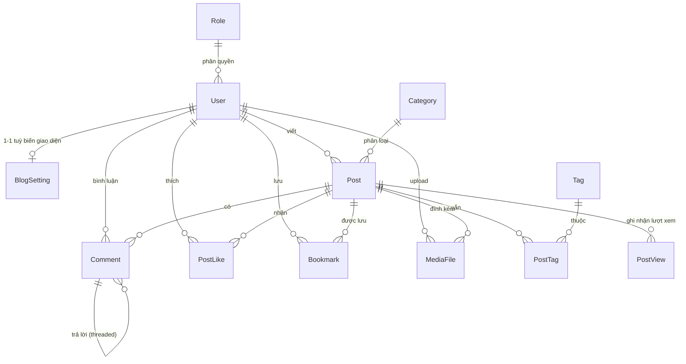

# ERD — Blogging Platform (Mini Project 2, Nhóm 2)

> **Kiến trúc đã chốt (hướng B):** 1 website chung cho tất cả bài viết.
> Mỗi content creator có trang cá nhân `/author/{username}` và tuỳ biến được theme
> (màu, font, layout) áp riêng cho trang đó. **Không** có bảng `Blog` riêng.

Stack: ASP.NET Core MVC + EF Core (Code First) + SQL Server 2022.
**Xác thực:** tự quản bằng Session (giống pattern CoreDay05), **không** dùng ASP.NET Core Identity.

---

## 1. Sơ đồ quan hệ tổng thể



**Tổng: 12 bảng tự thiết kế.** Vì không dùng Identity nên phải tự tạo bảng `User` và `Role`.

| Nhóm | Bảng |
|------|------|
| Người dùng & phân quyền | `User`, `Role` |
| Giao diện | `BlogSetting` |
| Nội dung | `Post`, `Category`, `Tag`, `PostTag`, `MediaFile` |
| Tương tác | `Comment`, `PostLike`, `Bookmark` |
| Thống kê | `PostView` |

---

## 2. Chi tiết từng bảng

### 2.1. `User` — Người dùng (tự thiết kế, không dùng Identity)

| Cột | Kiểu | Ràng buộc | Ý nghĩa |
|-----|------|-----------|---------|
| `Id` | `int` | **PK**, IDENTITY | |
| `UserName` | `nvarchar(50)` | NOT NULL, **UNIQUE** | Dùng luôn làm slug trang cá nhân `/author/{UserName}` |
| `Email` | `nvarchar(256)` | NOT NULL, **UNIQUE** | |
| `PasswordHash` | `nvarchar(255)` | NOT NULL | **Chỉ lưu chuỗi đã băm** — tuyệt đối không lưu mật khẩu thô |
| `DisplayName` | `nvarchar(100)` | NOT NULL | Tên hiển thị dưới bài viết |
| `AvatarUrl` | `nvarchar(500)` | NULL | Ảnh đại diện |
| `Bio` | `nvarchar(500)` | NULL | Giới thiệu ngắn trên trang cá nhân |
| `RoleId` | `int` | FK → `Role.Id`, NOT NULL | 1 user giữ đúng 1 vai trò |
| `IsLocked` | `bit` | NOT NULL, default `0` | Admin khoá tài khoản vi phạm (UC25) |
| `CreatedAt` | `datetime2` | NOT NULL | Ngày đăng ký |

---

### 2.1b. `Role` — Vai trò

| Cột | Kiểu | Ràng buộc | Ý nghĩa |
|-----|------|-----------|---------|
| `Id` | `int` | **PK**, IDENTITY | |
| `Name` | `nvarchar(50)` | NOT NULL, **UNIQUE** | `Admin` / `Author` / `Reader` |
| `Description` | `nvarchar(200)` | NULL | |

Seed sẵn 3 dòng khi chạy lần đầu:

| Role | Quyền |
|------|-------|
| `Admin` | Quản lý toàn hệ thống, gỡ nội dung vi phạm, quản lý Category/Tag |
| `Author` | Viết bài, duyệt comment **trên bài của mình**, đổi theme của mình |
| `Reader` | Đọc, comment, like, bookmark |

> **Vì sao 1 user chỉ 1 role (`RoleId` là cột trong `User`) thay vì bảng `UserRole` N-N?**
> Ba vai trò ở đây xếp bậc rõ ràng — Admin bao trùm Author, Author bao trùm Reader,
> nên không có ai cần giữ 2 vai trò cùng lúc. Dùng 1 cột FK gọn hơn và query đơn giản hơn hẳn.

---

### 2.1c. Cách lưu phiên đăng nhập (thay cho Identity)

Đăng nhập thành công thì lưu vào **Session**: `UserId`, `UserName`, `DisplayName`, `RoleName`.
Tên khoá được gom trong `Helpers/SessionKeys.cs` để không gõ sai chuỗi ở nhiều nơi.

Phân quyền dùng filter tự viết `[SessionAuthorize(Roles = "Author,Admin")]`
(`Filters/SessionAuthorizeAttribute.cs`) thay cho `[Authorize]` của Identity.

---

### 2.2. `BlogSetting` — Tuỳ biến giao diện (1-1 với User)

| Cột | Kiểu | Ràng buộc | Ý nghĩa |
|-----|------|-----------|---------|
| `UserId` | `int` | **PK + FK** → `User.Id` | Vừa là khoá chính vừa là khoá ngoại → ép quan hệ 1-1 |
| `ThemeName` | `nvarchar(50)` | NOT NULL, default `'light'` | Preset: `light` / `dark` / `serif` / `minimal` |
| `PrimaryColor` | `nvarchar(7)` | NOT NULL, default `'#2563eb'` | Mã hex, đè lên preset |
| `FontFamily` | `nvarchar(100)` | NOT NULL, default `'Be Vietnam Pro'` | Font chữ trang cá nhân |
| `LogoUrl` | `nvarchar(500)` | NULL | Branding |
| `Tagline` | `nvarchar(200)` | NULL | Slogan hiển thị dưới tên blog |
| `UpdatedAt` | `datetime2` | NOT NULL | Lần chỉnh sửa cuối |

> **Cách áp theme:** khi render `/author/{username}`, đọc `BlogSetting` của **tác giả trang đó**
> rồi đổ ra CSS variables trong `_Layout` — không cần build nhiều file CSS riêng.
> ```html
> <style>:root { --primary: @setting.PrimaryColor; --font: '@setting.FontFamily'; }</style>
> ```

---

### 2.3. `Category` — Chuyên mục (1 bài thuộc 1 chuyên mục)

| Cột | Kiểu | Ràng buộc | Ý nghĩa |
|-----|------|-----------|---------|
| `Id` | `int` | **PK**, IDENTITY | |
| `Name` | `nvarchar(100)` | NOT NULL, UNIQUE | "Lập trình", "Đời sống"... |
| `Slug` | `nvarchar(120)` | NOT NULL, **UNIQUE** | Dùng cho URL `/category/lap-trinh` |
| `Description` | `nvarchar(300)` | NULL | |

---

### 2.4. `Post` — Bài viết (bảng trung tâm)

| Cột | Kiểu | Ràng buộc | Ý nghĩa |
|-----|------|-----------|---------|
| `Id` | `int` | **PK**, IDENTITY | |
| `Title` | `nvarchar(200)` | NOT NULL | Tiêu đề |
| `Slug` | `nvarchar(220)` | NOT NULL, **UNIQUE**, INDEX | URL thân thiện `/post/huong-dan-aspnet` |
| `Summary` | `nvarchar(500)` | NULL | Tóm tắt hiển thị ngoài danh sách |
| `Content` | `nvarchar(MAX)` | NOT NULL | **HTML đã sanitize** từ rich text editor |
| `FeaturedImageUrl` | `nvarchar(500)` | NULL | Ảnh đại diện bài |
| `CategoryId` | `int` | FK → `Category.Id`, NULL | Cho phép NULL để không mất bài khi xoá chuyên mục |
| `AuthorId` | `int` | FK → `User.Id`, NOT NULL | Chủ sở hữu bài |
| `Status` | `tinyint` | NOT NULL, default `0` | `0`=Draft, `1`=Published, `2`=Unpublished |
| `PublishedAt` | `datetime2` | NULL | Chỉ có giá trị khi `Status = 1` |
| `ViewCount` | `int` | NOT NULL, default `0` | Bộ đếm **cache** (xem mục 4) |
| `LikeCount` | `int` | NOT NULL, default `0` | Bộ đếm cache |
| `CommentCount` | `int` | NOT NULL, default `0` | Bộ đếm cache — chỉ đếm comment đã duyệt |
| `CreatedAt` | `datetime2` | NOT NULL | |
| `UpdatedAt` | `datetime2` | NOT NULL | |

**Index đề xuất:**
- `UNIQUE (Slug)` — tra cứu theo URL
- `(Status, PublishedAt DESC)` — query trang chủ "bài mới nhất đã publish"
- `(AuthorId, Status)` — query trang cá nhân của tác giả

---

### 2.5. `Tag` — Thẻ

| Cột | Kiểu | Ràng buộc | Ý nghĩa |
|-----|------|-----------|---------|
| `Id` | `int` | **PK**, IDENTITY | |
| `Name` | `nvarchar(50)` | NOT NULL, UNIQUE | |
| `Slug` | `nvarchar(60)` | NOT NULL, **UNIQUE** | `/tag/aspnet-core` |

---

### 2.6. `PostTag` — Bảng trung gian N-N (Post ↔ Tag)

| Cột | Kiểu | Ràng buộc |
|-----|------|-----------|
| `PostId` | `int` | **PK (composite)** + FK → `Post.Id` |
| `TagId` | `int` | **PK (composite)** + FK → `Tag.Id` |

> Khoá chính ghép `(PostId, TagId)` — tự động chặn gắn trùng tag vào cùng 1 bài.

---

### 2.7. `Comment` — Bình luận (có phân cấp)

| Cột | Kiểu | Ràng buộc | Ý nghĩa |
|-----|------|-----------|---------|
| `Id` | `int` | **PK**, IDENTITY | |
| `PostId` | `int` | FK → `Post.Id`, NOT NULL | Bài được bình luận |
| `UserId` | `int` | FK → `User.Id`, NOT NULL | Người bình luận |
| `ParentCommentId` | `int` | FK → **chính bảng này**, NULL | NULL = comment gốc; có giá trị = trả lời |
| `Content` | `nvarchar(2000)` | NOT NULL | Text đã sanitize (chỉ cho phép `<b> <i> <a> <br>`) |
| `Status` | `tinyint` | NOT NULL, default `0` | `0`=Pending, `1`=Approved, `2`=Rejected, `3`=Flagged |
| `CreatedAt` | `datetime2` | NOT NULL | |
| `UpdatedAt` | `datetime2` | NOT NULL | |

**Lưu ý quan trọng:**
- Nên **giới hạn độ sâu thread tối đa 3 cấp** — sâu hơn thì UI vỡ và query đệ quy nặng.
- Chỉ hiển thị comment `Status = 1 (Approved)` cho người đọc.

---

### 2.8. `PostLike` — Lượt thích

| Cột | Kiểu | Ràng buộc |
|-----|------|-----------|
| `PostId` | `int` | **PK (composite)** + FK → `Post.Id` |
| `UserId` | `int` | **PK (composite)** + FK → `User.Id` |
| `CreatedAt` | `datetime2` | NOT NULL |

> Khoá ghép `(PostId, UserId)` → **1 user chỉ like 1 bài đúng 1 lần**, DB tự chặn, không cần check ở code.

---

### 2.9. `Bookmark` — Lưu bài để đọc sau

| Cột | Kiểu | Ràng buộc |
|-----|------|-----------|
| `PostId` | `int` | **PK (composite)** + FK → `Post.Id` |
| `UserId` | `int` | **PK (composite)** + FK → `User.Id` |
| `CreatedAt` | `datetime2` | NOT NULL |

> Cấu trúc giống `PostLike` nhưng **tách bảng riêng** vì là 2 hành vi khác nhau,
> gộp chung sẽ phải thêm cột `Type` → query rối và mất được ràng buộc khoá ghép.

---

### 2.10. `PostView` — Log lượt xem (phục vụ Analytics)

| Cột | Kiểu | Ràng buộc | Ý nghĩa |
|-----|------|-----------|---------|
| `Id` | `bigint` | **PK**, IDENTITY | Dùng `bigint` vì bảng này tăng nhanh nhất |
| `PostId` | `int` | FK → `Post.Id`, NOT NULL | |
| `UserId` | `int` | FK → `User.Id`, **NULL** | NULL = khách chưa đăng nhập |
| `IpHash` | `nvarchar(64)` | NOT NULL | SHA-256 của IP — chống đếm trùng mà không lưu IP thật (bảo mật) |
| `ViewedAt` | `datetime2` | NOT NULL | |

**Index:** `(PostId, ViewedAt)` — phục vụ biểu đồ "lượt xem theo ngày".

**Chống đếm trùng khi F5:** chỉ ghi thêm 1 dòng nếu trong **30 phút gần nhất** chưa có bản ghi
cùng `(PostId, IpHash)`.

---

### 2.11. `MediaFile` — File ảnh/media upload

| Cột | Kiểu | Ràng buộc | Ý nghĩa |
|-----|------|-----------|---------|
| `Id` | `int` | **PK**, IDENTITY | |
| `OriginalFileName` | `nvarchar(255)` | NOT NULL | Tên gốc user upload (chỉ để hiển thị) |
| `StoredFileName` | `nvarchar(100)` | NOT NULL, UNIQUE | Tên đã đổi thành GUID — **chống ghi đè & chống chạy file độc** |
| `ContentType` | `nvarchar(100)` | NOT NULL | `image/png`, `image/jpeg`... |
| `SizeBytes` | `bigint` | NOT NULL | Để giới hạn dung lượng |
| `PostId` | `int` | FK → `Post.Id`, **NULL** | NULL khi vừa upload mà chưa gắn vào bài nào |
| `UploadedById` | `int` | FK → `User.Id`, NOT NULL | |
| `UploadedAt` | `datetime2` | NOT NULL | |

---

## 3. Quy tắc xoá (Delete Behavior) — chỗ hay lỗi nhất

SQL Server **không cho phép nhiều đường cascade cùng trỏ về 1 bảng**
(lỗi `may cause cycles or multiple cascade paths`). Phải cấu hình rõ trong `OnModelCreating`:

Tổng cộng **17 khoá ngoại** cần cấu hình:

**Nhóm `Cascade` — xoá cha thì xoá luôn con (8 quan hệ)**

| Quan hệ | Lý do |
|---------|-------|
| `User` → `BlogSetting` | Xoá user thì xoá cấu hình giao diện của họ |
| `Post` → `Comment` | Xoá bài thì xoá luôn bình luận |
| `Post` → `PostTag` | Dữ liệu phụ thuộc hoàn toàn vào bài |
| `Post` → `PostLike` | |
| `Post` → `Bookmark` | |
| `Post` → `PostView` | |
| `Post` → `MediaFile` | |
| `Tag` → `PostTag` | Xoá thẻ thì gỡ khỏi mọi bài viết |

**Nhóm `Restrict` — chặn xoá cha khi còn con (8 quan hệ)**

| Quan hệ | Lý do |
|---------|-------|
| `Role` → `User` | Không cho xoá vai trò khi vẫn còn user đang giữ |
| `User` → `Post` | Không cho xoá user còn bài viết; muốn xoá thì ẩn bài trước |
| `User` → `Comment` | ⚠️ Nếu để Cascade sẽ tạo 2 đường cascade tới `Comment` (qua Post và qua User) → SQL Server báo lỗi khi migrate |
| `User` → `PostLike` | ⚠️ Cùng lý do — `PostLike` đã nhận cascade từ `Post` |
| `User` → `Bookmark` | ⚠️ Cùng lý do |
| `User` → `PostView` | ⚠️ Cùng lý do |
| `User` → `MediaFile` | ⚠️ Cùng lý do |
| `Comment` → `Comment` (self) | Self-reference bắt buộc `Restrict`, xử lý xoá thread bằng code |

**Nhóm `SetNull` — giữ con lại, xoá liên kết (1 quan hệ)**

| Quan hệ | Lý do |
|---------|-------|
| `Category` → `Post` | Xoá chuyên mục thì bài vẫn còn, chỉ mất phân loại |

> **Quy tắc dễ nhớ:** mọi quan hệ xuất phát từ `User` đều để `Restrict`.
> Vì bảng nào cũng đã nhận `Cascade` từ `Post` rồi — thêm đường thứ hai từ `User` là SQL Server từ chối ngay.

> **Lưu ý khi đọc file SQL sinh ra:** `Restrict` trong EF Core được dịch thành
> `ON DELETE NO ACTION` trong SQL Server — hai tên gọi, cùng một hành vi.

---

## 4. Vì sao có cả `ViewCount` lẫn bảng `PostView`?

Đây là kỹ thuật **denormalization** — cố ý lưu dư dữ liệu để đọc nhanh:

| | Dùng để làm gì |
|---|---|
| `Post.ViewCount` | Hiển thị số "1.2K lượt xem" ngoài danh sách bài. Nếu mỗi lần render phải `COUNT(*)` trên `PostView` cho **từng bài** trong danh sách → N+1 query, rất chậm |
| `PostView` (log) | Vẽ biểu đồ theo thời gian, phân tích ai xem, xem lúc nào |

**Cách đồng bộ:** khi ghi 1 dòng `PostView` mới thì `UPDATE Post SET ViewCount = ViewCount + 1`.
Hai lệnh này nằm trong cùng 1 transaction. Áp dụng tương tự cho `LikeCount`, `CommentCount`.

---

## 5. Bảng tra: yêu cầu đề bài → bảng đáp ứng

| Yêu cầu trong đề | Bảng liên quan |
|------------------|----------------|
| 2. Registration & Authentication | `User`, `Role` + Session |
| 3. Blog Post Management (title, content, category, tag, featured image) | `Post`, `Category`, `Tag`, `PostTag`, `MediaFile` |
| 3. Publish / Unpublish | `Post.Status`, `Post.PublishedAt` |
| 4. Comment + moderation + threaded | `Comment` (`Status`, `ParentCommentId`) |
| 5. Customization & Theming | `BlogSetting` |
| 6. Like / Bookmark / Share | `PostLike`, `Bookmark` (share = link ngoài, không cần bảng) |
| 6. Analytics (page views, engagement) | `PostView` + các cột `*Count` trong `Post` |
| 7. Search & Filter | `Post.Title/Content`, `Category`, `Tag`, `User.DisplayName` |

---

## 6. Việc cần làm tiếp

1. Vẽ **Use Case diagram** (4 actor: Guest / Reader / Author / Admin)
2. Dựng project ASP.NET Core MVC + cấu hình Session
3. Viết Entity classes theo đúng ERD này → `dotnet ef migrations add InitialCreate`
4. Seed dữ liệu mẫu: 3 role, 1 admin, vài category/tag
