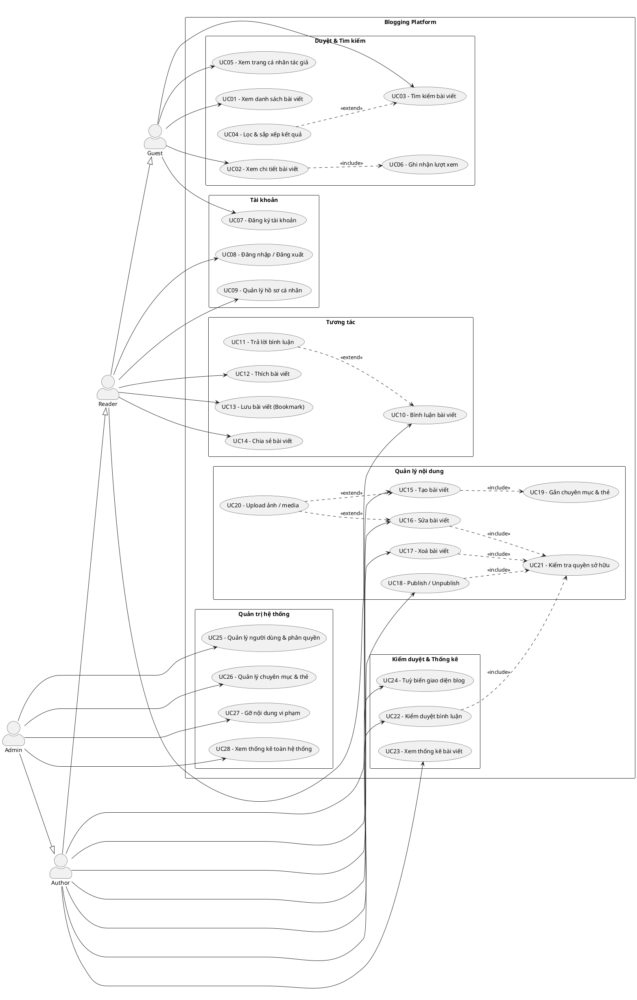
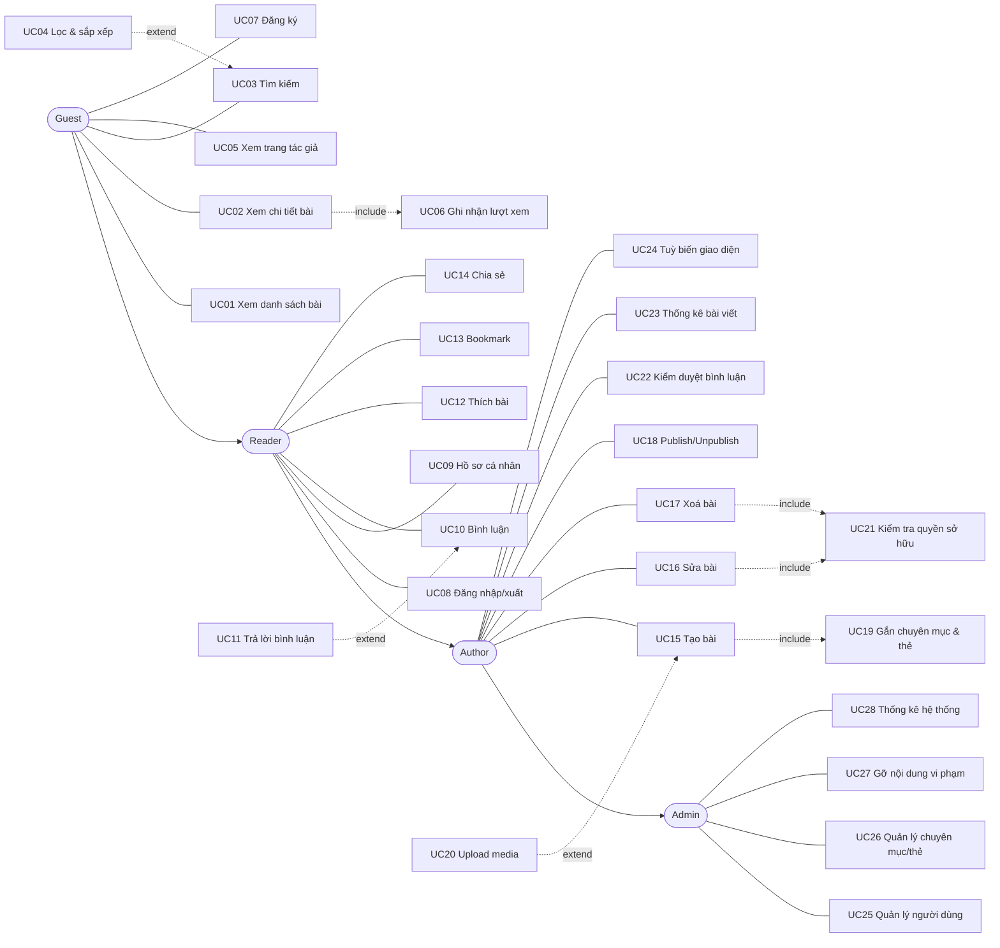

# Use Case Diagram — Blogging Platform (Mini Project 2, Nhóm 2)

> Đi kèm tài liệu [blog-platform-erd.md](./blog-platform-erd.md).
> Kiến trúc: 1 website chung, mỗi content creator có trang cá nhân `/author/{username}` tuỳ biến được theme.

---

## 1. Danh sách Actor

| Actor | Mô tả | Kế thừa từ |
|-------|-------|------------|
| **Guest** | Khách vãng lai, chưa đăng nhập. Chỉ đọc nội dung công khai | — |
| **Reader** | Người dùng đã đăng nhập. Tương tác được với bài viết | Guest |
| **Author** | Content creator. Sở hữu và quản lý bài viết của mình | Reader |
| **Admin** | Quản trị viên toàn hệ thống | Author |

> **Quan hệ generalization (mũi tên rỗng):** Admin làm được mọi thứ Author làm,
> Author làm được mọi thứ Reader làm, Reader làm được mọi thứ Guest làm.
> Nhờ vậy không phải vẽ lại use case trùng cho từng actor.

---

## 2. Sơ đồ Use Case (PlantUML — dùng để nộp bài)

> Dán code dưới vào [plantuml.com/plantuml](https://www.plantuml.com/plantuml/uml/) để xuất ảnh PNG.

---

## 3. Sơ đồ rút gọn (Mermaid — xem nhanh ngay trong Markdown)

> UML chuẩn không có sơ đồ use case trong Mermaid, đây là bản mô phỏng để anh xem nhanh
> khi chưa muốn mở PlantUML.

---

## 4. Giải thích `<<include>>` và `<<extend>>`

Đây là 2 ký hiệu hay bị nhầm nhất khi vẽ use case:

| | `<<include>>` | `<<extend>>` |
|---|---|---|
| Ý nghĩa | **Luôn luôn** xảy ra | **Có thể** xảy ra, tuỳ điều kiện |
| Hướng mũi tên | Use case chính → use case con | Use case phụ → use case chính |
| Ví dụ trong bài | Xem chi tiết bài **luôn** ghi nhận lượt xem | Tạo bài viết **có thể** upload ảnh, cũng có thể không |

**Các quan hệ trong sơ đồ:**

| Quan hệ | Loại | Vì sao |
|---------|------|--------|
| UC02 → UC06 Ghi nhận lượt xem | include | Mở bài nào cũng phải đếm view |
| UC15 → UC19 Gắn chuyên mục & thẻ | include | Bài viết bắt buộc phải có phân loại |
| UC16/17/18/22 → UC21 Kiểm tra quyền sở hữu | include | ⚠️ **Bắt buộc** — chống lỗi IDOR (xem mục 6) |
| UC20 Upload media → UC15/UC16 | extend | Ảnh là tuỳ chọn |
| UC11 Trả lời bình luận → UC10 | extend | Có thể comment gốc, có thể trả lời |
| UC04 Lọc & sắp xếp → UC03 | extend | Tìm xong mới lọc thêm nếu muốn |

---

## 5. Đặc tả chi tiết 2 use case quan trọng

### UC15 — Tạo bài viết

| Mục | Nội dung |
|-----|----------|
| **Actor** | Author |
| **Tiền điều kiện** | Đã đăng nhập, có role `Author` hoặc `Admin` |
| **Hậu điều kiện** | Bản ghi mới trong bảng `Post` với `Status = 0 (Draft)` |
| **Luồng chính** | 1. Author chọn "Viết bài mới" 2. Hệ thống hiển thị form (tiêu đề, nội dung rich text, chuyên mục, thẻ, ảnh đại diện) 3. Author nhập nội dung 4. *(extend UC20)* Author upload ảnh nếu cần 5. *(include UC19)* Author chọn chuyên mục và gắn thẻ 6. Author bấm "Lưu nháp" 7. Hệ thống **sanitize HTML** trong nội dung 8. Hệ thống sinh `Slug` từ tiêu đề, kiểm tra trùng 9. Hệ thống lưu bài, chuyển về danh sách bài của tôi |
| **Luồng phụ** | 6a. Tiêu đề để trống → báo lỗi tại field, giữ nguyên dữ liệu đã nhập 8a. `Slug` bị trùng → tự thêm hậu tố số: `bai-viet-cua-toi-2` |
| **Ngoại lệ** | 4a. File upload sai định dạng hoặc quá 5MB → từ chối, hiện thông báo |

### UC22 — Kiểm duyệt bình luận

| Mục | Nội dung |
|-----|----------|
| **Actor** | Author (trên bài của mình), Admin (trên mọi bài) |
| **Tiền điều kiện** | Đã đăng nhập, có bình luận ở trạng thái `Pending` |
| **Hậu điều kiện** | `Comment.Status` được cập nhật; nếu duyệt thì `Post.CommentCount` tăng |
| **Luồng chính** | 1. Author mở trang "Quản lý bình luận" 2. Hệ thống liệt kê bình luận theo trạng thái 3. *(include UC21)* Hệ thống kiểm tra Author có sở hữu bài chứa bình luận đó không 4. Author chọn hành động: Duyệt / Từ chối / Gắn cờ 5. Hệ thống cập nhật `Status` và bộ đếm |
| **Luồng phụ** | 3a. Không sở hữu bài → trả về HTTP 403 Forbidden |
| **Ghi chú** | Bình luận mới mặc định `Status = 0 (Pending)`, chưa hiện với người đọc |

---

## 6. Vì sao có UC21 "Kiểm tra quyền sở hữu"?

Đây không phải chức năng người dùng nhìn thấy, nhưng **phải vẽ ra sơ đồ** vì đề chấm mục Security.

**Vấn đề (lỗi IDOR — Insecure Direct Object Reference):**
Author A đăng nhập, sửa URL từ `/Post/Edit/5` (bài của mình) thành `/Post/Edit/9` (bài của Author B).
Nếu code chỉ kiểm tra "đã đăng nhập chưa" mà không kiểm tra "có phải chủ bài không"
→ A sửa/xoá được bài của B.

**Cách chặn:** trong mọi action sửa/xoá/publish, so sánh `post.AuthorId` với ID người đang đăng nhập
trước khi cho thao tác.

---

## 7. Bảng tra: yêu cầu đề bài → Use Case

| Yêu cầu trong đề | Use Case đáp ứng |
|------------------|------------------|
| 2. User Registration and Authentication | UC07, UC08, UC09 |
| 3. Blog Post Management | UC15, UC16, UC17, UC18, UC19, UC20 |
| 4. Comment Management (moderation, threaded) | UC10, UC11, UC22 |
| 5. Customization and Theming | UC24 |
| 6. User Interaction (like, share, bookmark) | UC12, UC13, UC14 |
| 6. Analytics và statistics | UC06, UC23, UC28 |
| 7. Search Functionality (keyword, category, tag, author) | UC03, UC04 |

→ **28 use case phủ đủ 7 nhóm yêu cầu chức năng của đề.**

---

## 8. Việc cần làm tiếp

1. Xuất sơ đồ PlantUML ra ảnh PNG để chèn vào báo cáo
2. Dựng project ASP.NET Core MVC + cấu hình Session (tự quản đăng nhập)
3. Viết Entity classes theo [ERD](./blog-platform-erd.md) → `dotnet ef migrations add InitialCreate`
4. Seed 3 role (`Admin`, `Author`, `Reader`) + 1 tài khoản admin
