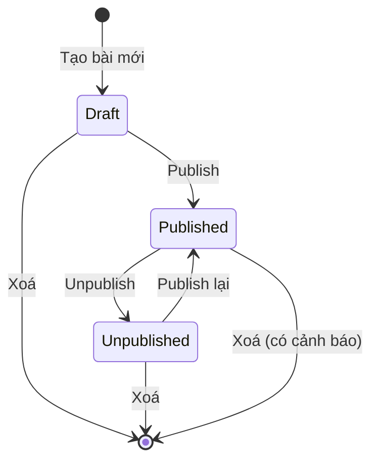
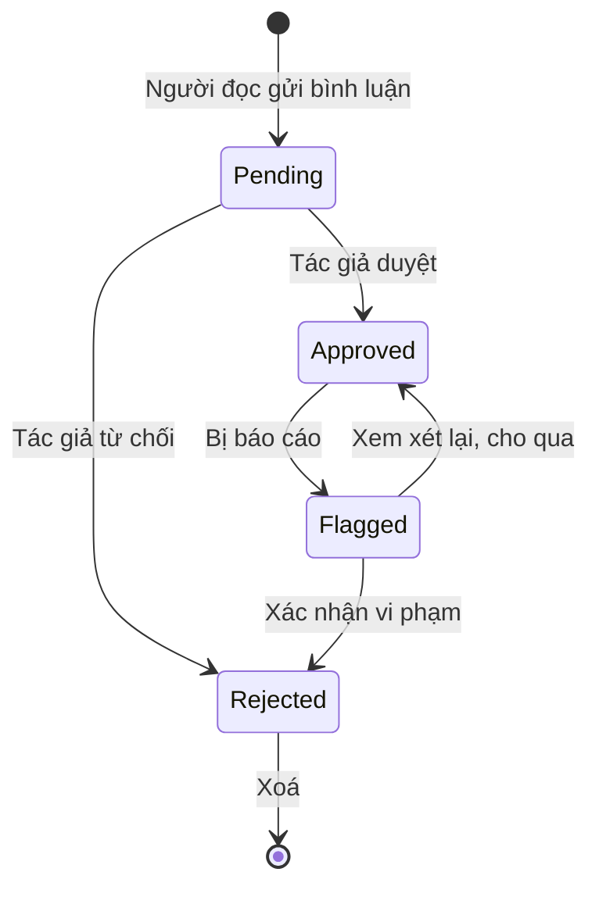

# Nghiệp vụ hệ thống — Blogging Platform

Tài liệu định nghĩa **quy tắc nghiệp vụ** để viết tầng Service.
Đọc cùng: [ERD](./blog-platform-erd.md) · [Use Case](./blog-platform-usecase.md) · [Phân công Issue](./github-issues.md)

---

## 0. Tầng nghiệp vụ nằm ở đâu

```
Controller  →  Service  →  DbContext  →  Database
  mỏng          dày         truy vấn
```

| Tầng | Chịu trách nhiệm | Không được làm |
|------|------------------|----------------|
| **Controller** | Nhận request, gọi Service, trả View | Không viết `if` nghiệp vụ, không query DB trực tiếp |
| **Service** | **Toàn bộ quy tắc trong tài liệu này** | Không đụng `HttpContext.Session` (trừ nơi ghi rõ), không trả về View |
| **DbContext** | Truy vấn dữ liệu | Không chứa logic |

**Quy ước:** Controller chỉ nên dài 5–15 dòng mỗi action. Thấy dài hơn là logic đang
đặt sai chỗ, phải đẩy xuống Service.

**Cách Service báo lỗi về Controller:** trả về `string` thông báo (giống `EventService`
ở CoreDay05), hoặc `bool` + `out string message`. Thống nhất dùng **`string`**:
trả `"SUCCESS"` khi thành công, trả câu thông báo tiếng Việt khi lỗi.

### 0.1. Vì sao dự án không tách tầng Repository

Giáo trình Aptech (Session 9, 10) dạy **Onion Architecture** với 4 tầng:
Domain Entities → **Repository** → Service → UI. Một số bài trước cũng làm theo:

| Bài | Có `Repositories/` |
|-----|:---:|
| CoreFirstDay03 | ✅ |
| CoreDay04, CoreDay05 | ❌ |
| Pretest, PretestWDA | ✅ |

**Dự án này chọn không tách Repository** — Service gọi thẳng `DbContext`, theo pattern
CoreDay04/05. Đây là quyết định có chủ đích, không phải thiếu sót.

**Lý do:**

1. **Không có nhu cầu đổi nguồn dữ liệu.** Repository sinh ra để tầng nghiệp vụ không
   phụ thuộc cách lưu trữ — đổi từ SQL Server sang MongoDB chỉ sửa 1 chỗ. Dự án này
   gắn với SQL Server, không có kịch bản đổi.
2. **`DbContext` của EF Core đã là một Repository.** `DbSet<Post>` bản thân nó là
   Repository pattern, `SaveChanges()` là Unit of Work. Bọc thêm một lớp nữa
   phần lớn chỉ là gọi lại cùng một hàm.
3. **12 bảng × 2 file = 24 file repository**, đa số chỉ có `GetAll`, `GetById`, `Add`,
   `Update`, `Delete` giống hệt nhau. Với nhóm 4 người trong thời gian có hạn, công sức
   đó nên dồn vào phần nghiệp vụ thật.

**Cái giá phải trả và cách bù:**

| Vấn đề | Cách xử lý |
|--------|-----------|
| Service phình to vì ôm cả query lẫn nghiệp vụ | Tách phần query ra **hàm `private`** trong cùng Service |
| Không còn tầng riêng lo tối ưu truy vấn | Quy tắc **8.3** — mọi truy vấn chỉ đọc phải có `AsNoTracking()` |
| Khó viết unit test cho nghiệp vụ | Dự án không yêu cầu unit test |

Ví dụ cách giữ Service gọn — tách query xuống hàm private:

```csharp
public async Task<string> PublishAsync(int postId, int currentUserId)
{
    var post = await FindPostAsync(postId);            // truy vấn
    if (post == null) return "Bài viết không tồn tại";
    if (post.AuthorId != currentUserId) return "Bạn không có quyền";
    if (string.IsNullOrWhiteSpace(post.Content)) return "Nội dung không được để trống";

    post.Status = PostStatus.Published;                 // nghiệp vụ
    post.PublishedAt ??= DateTime.Now;                  // quy tắc 1.3
    post.UpdatedAt = DateTime.Now;
    await context.SaveChangesAsync();
    return "SUCCESS";
}

// Truy vấn tách riêng để phần nghiệp vụ ở trên đọc liền mạch
private async Task<Post?> FindPostAsync(int postId)
    => await context.Posts.FirstOrDefaultAsync(p => p.Id == postId);
```

> **Nếu được hỏi trong buổi bảo vệ:** dự án dùng kiến trúc phân tầng
> Controller → Service → DbContext. Bỏ tầng Repository vì `DbContext` đã đóng vai trò đó,
> và dự án không có nhu cầu thay đổi nguồn dữ liệu. Ranh giới các tầng vẫn giữ nghiêm:
> Controller không query database, Service không trả về View.

---

## Luồng 1 — Vòng đời bài viết

**Service phụ trách:** `IPostService` · **Issue #5** · Khu C

### Sơ đồ trạng thái



`PostStatus`: `Draft = 0` · `Published = 1` · `Unpublished = 2`

### Quy tắc

| # | Quy tắc | Vì sao |
|---|---------|--------|
| 1.1 | Bài mới luôn ở `Draft`, `PublishedAt = null` | Tránh đăng nhầm bài chưa xong |
| 1.2 | Chuyển sang `Published` lần đầu → gán `PublishedAt = DateTime.Now` | Mốc thời gian đăng |
| 1.3 | `Unpublished` → `Published` lại thì **giữ nguyên `PublishedAt` cũ** | Bài không "mới" lại chỉ vì ẩn đi rồi hiện |
| 1.4 | Không cho publish khi `Title` hoặc `Content` rỗng | Tránh bài trống lọt ra ngoài |
| 1.5 | Sửa bài đã `Published` → vẫn `Published`, **không** bắt duyệt lại | Tác giả tự chịu trách nhiệm bài mình |
| 1.6 | Mọi lần sửa đều cập nhật `UpdatedAt` | Phục vụ sắp xếp và hiển thị |
| 1.7 | `Unpublished` thì **giữ nguyên** comment, like, bookmark | Publish lại là có đủ, không mất dữ liệu |
| 1.8 | Xoá bài → xoá luôn comment, like, bookmark, view, media (`Cascade` trong ERD) | Dữ liệu con không tồn tại độc lập |
| 1.9 | **Chỉ chủ bài viết hoặc Admin** được sửa, xoá, publish | Chống lỗi IDOR |

### Quy tắc sinh Slug

| # | Quy tắc | Ví dụ |
|---|---------|-------|
| 1.10 | Bỏ dấu tiếng Việt, chữ thường, thay khoảng trắng bằng `-` | `Học ASP.NET Core` → `hoc-aspnet-core` |
| 1.11 | Bỏ ký tự đặc biệt, gộp nhiều `-` liên tiếp thành một | `C# & .NET!!` → `c-net` |
| 1.12 | Trùng slug → thêm hậu tố số tăng dần | `hoc-aspnet-core-2` |
| 1.13 | Slug **không đổi** khi sửa tiêu đề bài đã publish | Đổi slug làm hỏng link cũ người khác đã chia sẻ |
| 1.14 | Tiêu đề toàn ký tự đặc biệt → slug rỗng → dùng `bai-viet-{Id}` | Trường hợp biên |

### Chữ ký hàm đề xuất

```csharp
public interface IPostService
{
    // Đọc
    Task<Post?> GetBySlugAsync(string slug);
    Task<List<Post>> GetPublishedAsync(int page, int pageSize);
    Task<List<Post>> GetByAuthorAsync(int authorId, PostStatus? status);

    // Ghi — trả "SUCCESS" hoặc câu thông báo lỗi
    Task<string> CreateAsync(PostEditViewModel model, int authorId);
    Task<string> UpdateAsync(PostEditViewModel model, int currentUserId);
    Task<string> DeleteAsync(int postId, int currentUserId);
    Task<string> PublishAsync(int postId, int currentUserId);
    Task<string> UnpublishAsync(int postId, int currentUserId);

    // Dùng chung
    Task<string> GenerateSlugAsync(string title);
    Task<bool> IsOwnerAsync(int postId, int userId);   // quy tắc 1.9
}
```

---

## Luồng 2 — Kiểm duyệt bình luận

**Service phụ trách:** `ICommentService` · **Issue #7, #8** · Khu D

### Sơ đồ trạng thái



`CommentStatus`: `Pending = 0` · `Approved = 1` · `Rejected = 2` · `Flagged = 3`

### Quy tắc

| # | Quy tắc | Vì sao |
|---|---------|--------|
| 2.1 | Bình luận mới luôn `Pending` | Đề bài yêu cầu có kiểm duyệt |
| 2.2 | **Ngoại lệ:** tác giả bình luận trên bài của chính mình → thẳng `Approved` | Không bắt tự duyệt mình |
| 2.3 | Người đọc chỉ thấy comment `Approved` | |
| 2.4 | Người gửi thấy comment `Pending` **của mình** kèm nhãn "Chờ duyệt" | Tránh tưởng bị mất, gửi lại nhiều lần |
| 2.5 | Comment cha **không** `Approved` → toàn bộ nhánh con bị ẩn theo | Trả lời một comment không hiển thị thì vô nghĩa |
| 2.6 | Độ sâu tối đa **3 cấp**. Trả lời cấp 3 → gắn vào cấp 3 cùng cha | Vỡ giao diện, query nặng |
| 2.7 | Nội dung phải sanitize trước khi lưu, chỉ cho `<b> <i> <a> <br>` | Chống XSS |
| 2.8 | `Approved` → `Post.CommentCount + 1`; rời `Approved` → `- 1` | Bộ đếm chỉ tính comment hiển thị |
| 2.9 | Người duyệt: **chủ bài viết** hoặc **Admin** | Tác giả tự quản bài mình |
| 2.10 | Xoá comment cha → xoá cả nhánh con | Không để comment mồ côi |
| 2.11 | Không cho bình luận trên bài `Draft` hoặc `Unpublished` | Bài chưa/không công khai |

### Cách dựng cây bình luận

Lấy **1 query duy nhất** rồi dựng cây trong bộ nhớ — không query lặp theo từng cấp:

```csharp
// 1. Lấy hết comment Approved của bài
var all = await context.Comments
    .Include(c => c.User)
    .Where(c => c.PostId == postId && c.Status == CommentStatus.Approved)
    .OrderBy(c => c.CreatedAt)
    .ToListAsync();

// 2. Dựng cây trong bộ nhớ, gán Level 1..3
```

### Chữ ký hàm đề xuất

```csharp
public interface ICommentService
{
    Task<List<CommentViewModel>> GetTreeByPostAsync(int postId, int? currentUserId);
    Task<string> CreateAsync(int postId, int userId, int? parentCommentId, string content);

    // Kiểm duyệt — Issue #8
    Task<List<Comment>> GetPendingByAuthorAsync(int authorId);
    Task<string> ApproveAsync(int commentId, int currentUserId);
    Task<string> RejectAsync(int commentId, int currentUserId);
    Task<string> FlagAsync(int commentId, int currentUserId);
    Task<string> DeleteAsync(int commentId, int currentUserId);
    Task<int> CountPendingAsync(int authorId);
}
```

---

## Luồng 3 — Tài khoản và phân quyền

**Service phụ trách:** `IAccountService`, `IPasswordService` · **Issue #1, #3, #13** · Khu A

### Quy tắc đăng ký, đăng nhập

| # | Quy tắc | Vì sao |
|---|---------|--------|
| 3.1 | `UserName` và `Email` không trùng (không phân biệt hoa thường) | |
| 3.2 | `UserName` chỉ chữ thường, số, dấu `-` — vì dùng làm URL `/author/{username}` | |
| 3.3 | Mật khẩu tối thiểu 6 ký tự, có chữ và số | Mức tối thiểu hợp lý cho bài tập |
| 3.4 | **Chỉ lưu `PasswordHash`**, tuyệt đối không lưu mật khẩu thô | |
| 3.5 | Tài khoản mới mặc định role `Reader` | |
| 3.6 | Đăng nhập sai → báo chung *"Sai tài khoản hoặc mật khẩu"* | Không tiết lộ tài khoản nào tồn tại |
| 3.7 | `IsLocked = true` → chặn đăng nhập, báo *"Tài khoản đã bị khoá"* | |
| 3.8 | Đăng nhập xong lưu Session: `UserId`, `UserName`, `DisplayName`, `RoleName` | |
| 3.9 | Session hết hạn sau **30 phút** không hoạt động | Đã cấu hình trong `Program.cs` |

### Bảng phân quyền

| Hành động | Guest | Reader | Author | Admin |
|-----------|:-----:|:------:|:------:|:-----:|
| Xem bài đã publish, tìm kiếm | ✅ | ✅ | ✅ | ✅ |
| Bình luận, thích, lưu bài | ❌ | ✅ | ✅ | ✅ |
| Viết bài | ❌ | ❌ | ✅ | ✅ |
| Sửa/xoá bài **của mình** | ❌ | ❌ | ✅ | ✅ |
| Sửa/xoá bài **người khác** | ❌ | ❌ | ❌ | ✅ |
| Duyệt comment trên bài **của mình** | ❌ | ❌ | ✅ | ✅ |
| Duyệt comment trên **mọi bài** | ❌ | ❌ | ❌ | ✅ |
| Tuỳ biến giao diện blog | ❌ | ❌ | ✅ | ✅ |
| Quản lý user, chuyên mục, thẻ | ❌ | ❌ | ❌ | ✅ |

### Quy tắc quản trị

| # | Quy tắc | Vì sao |
|---|---------|--------|
| 3.10 | Reader thành Author: **Admin đổi role thủ công** | Đơn giản, đủ dùng cho bài tập |
| 3.11 | Admin **không tự khoá** tài khoản của chính mình | Tránh khoá hết đường vào hệ thống |
| 3.12 | Hệ thống phải luôn còn **ít nhất 1 Admin** | Chặn hạ role Admin cuối cùng |
| 3.13 | Khoá tài khoản → bài viết của họ **vẫn hiển thị bình thường** | Khoá là chặn đăng nhập, không phải gỡ nội dung |
| 3.14 | Không cho xoá user còn bài viết (`Restrict` trong ERD) | Muốn ẩn thì unpublish bài trước |
| 3.15 | Hạ role Author → Reader: bài cũ giữ nguyên, chỉ mất quyền viết mới | |

### Chữ ký hàm đề xuất

```csharp
public interface IPasswordService
{
    string Hash(string plainPassword);
    bool Verify(string plainPassword, string hash);
}

public interface IAccountService
{
    Task<string> RegisterAsync(RegisterViewModel model);
    Task<User?> ValidateLoginAsync(string userName, string password);  // null = thất bại
    Task<User?> GetByUserNameAsync(string userName);
    Task<string> UpdateProfileAsync(int userId, string displayName, string? bio, string? avatarUrl);

    // Quản trị — Issue #13
    Task<List<User>> GetAllAsync();
    Task<string> ChangeRoleAsync(int userId, int newRoleId, int currentAdminId);
    Task<string> ToggleLockAsync(int userId, int currentAdminId);
}
```

---

## Luồng 4 — Đếm số liệu và tương tác

**Service phụ trách:** `IAnalyticsService`, `IInteractionService` · **Issue #9, #12** · Khu C, D

### Vì sao có 2 chỗ lưu số liệu

| Nơi | Vai trò |
|-----|---------|
| `PostViews` (bảng log) | Chi tiết từng lượt xem, phục vụ biểu đồ theo thời gian |
| `Post.ViewCount` (bộ đếm) | Hiển thị nhanh ngoài danh sách bài |

Không có bộ đếm thì mỗi lần render danh sách 10 bài phải `COUNT(*)` 10 lần → **N+1 query**.

### Quy tắc đếm lượt xem

| # | Quy tắc | Vì sao |
|---|---------|--------|
| 4.1 | Ghi 1 dòng `PostViews` khi mở trang chi tiết bài `Published` | |
| 4.2 | Cùng `(PostId, IpHash)` trong **30 phút** chỉ tính 1 lần | Chống F5 spam |
| 4.3 | Lưu `IpHash` = SHA-256 của IP, **không lưu IP thật** | Không giữ dữ liệu cá nhân |
| 4.4 | Tác giả xem bài của chính mình → **không tính** | Số liệu mới trung thực |
| 4.5 | Ghi `PostViews` và tăng `Post.ViewCount` trong **cùng 1 transaction** | Hai số không được lệch |
| 4.6 | Ghi view lỗi thì **không chặn** việc hiển thị bài | Thống kê không quan trọng bằng nội dung |

### Quy tắc thích và lưu bài

| # | Quy tắc | Vì sao |
|---|---------|--------|
| 4.7 | 1 người thích 1 bài đúng 1 lần — khoá chính ghép `(PostId, UserId)` tự chặn | Không cần kiểm tra thủ công |
| 4.8 | Thích/bỏ thích là **cùng 1 nút** (toggle) | |
| 4.9 | Thích → `Post.LikeCount + 1`, bỏ thích → `- 1`, trong cùng transaction | |
| 4.10 | Tác giả **được** thích bài của chính mình | Không đáng cấm |
| 4.11 | Chỉ thích/lưu được bài `Published` | |
| 4.12 | Chia sẻ chỉ là link ngoài, **không lưu database** | Không cần thiết |
| 4.13 | Xoá bài → mọi bộ đếm biến mất theo (`Cascade`) | |

### Chữ ký hàm đề xuất

```csharp
public interface IAnalyticsService
{
    // Gọi từ BlogController.Detail — Khu B gọi, Khu C viết thân hàm
    Task RecordViewAsync(int postId, HttpContext httpContext);

    Task<AnalyticsViewModel> GetByAuthorAsync(int authorId);
    Task<AnalyticsViewModel> GetSystemWideAsync();          // Issue #13
    Task<List<(DateTime Ngay, int SoLuot)>> GetViewsByDayAsync(int postId, int soNgay);
}

public interface IInteractionService
{
    Task<string> ToggleLikeAsync(int postId, int userId);
    Task<string> ToggleBookmarkAsync(int postId, int userId);
    Task<bool> IsLikedAsync(int postId, int userId);
    Task<bool> IsBookmarkedAsync(int postId, int userId);
    Task<List<Post>> GetBookmarkedPostsAsync(int userId);
}
```

---

## Luồng 5 — Tuỳ biến giao diện

**Service phụ trách:** `IBlogSettingService` · **Issue #11** · Khu B

### Phạm vi áp theme

Đây là chỗ dễ hiểu sai nhất. Quy tắc:

| Trang | Áp theme của ai |
|-------|-----------------|
| Trang chủ `/` | Theme **mặc định** của hệ thống |
| Kết quả tìm kiếm | Theme **mặc định** |
| Trang tác giả `/author/{username}` | Theme của **tác giả đó** |
| Chi tiết bài `/post/{slug}` | Theme của **tác giả bài đó** |
| Khu Author, Khu Admin | Theme **mặc định** |

### Quy tắc

| # | Quy tắc | Vì sao |
|---|---------|--------|
| 5.1 | Mỗi user có tối đa 1 `BlogSetting` — quan hệ 1-1 | |
| 5.2 | Chưa cấu hình → dùng mặc định: `light`, `#2563eb`, `Be Vietnam Pro` | |
| 5.3 | Chỉ Author và Admin được tuỳ biến, và **chỉ theme của chính mình** | |
| 5.4 | `PrimaryColor` phải đúng dạng hex `#RRGGBB` | Chèn thẳng vào CSS, sai định dạng là vỡ giao diện |
| 5.5 | `FontFamily` chọn từ **danh sách cố định**, không cho nhập tự do | Chặn chèn mã độc qua CSS |
| 5.6 | Theme áp bằng CSS variables trong `_Layout`, không sinh file CSS riêng | |
| 5.7 | Đổi theme cập nhật `UpdatedAt` | |

> ⚠️ **Cảnh báo bảo mật:** `PrimaryColor` và `FontFamily` được chèn thẳng vào thẻ
> `<style>`. Không kiểm tra định dạng thì người dùng nhập
> `red; } body { background: url(javascript:...)` là chèn được CSS tuỳ ý.
> **Bắt buộc** kiểm tra bằng regex trước khi render.

### Chữ ký hàm đề xuất

```csharp
public interface IBlogSettingService
{
    Task<BlogSetting> GetByUserIdAsync(int userId);        // chưa có thì trả mặc định
    Task<BlogSetting> GetByUserNameAsync(string userName);
    Task<string> UpdateAsync(int userId, BlogSettingViewModel model);
    List<string> GetAvailableFonts();                       // quy tắc 5.5
    bool IsValidHexColor(string color);                     // quy tắc 5.4
}
```

---

## Luồng 6 — Tìm kiếm và hiển thị

**Service phụ trách:** `ISearchService` · **Issue #10** · Khu B

### Quy tắc

| # | Quy tắc | Vì sao |
|---|---------|--------|
| 6.1 | **Chỉ tìm trong bài `Published`** | Không được lộ bài nháp |
| 6.2 | Tìm trong `Title`, `Summary` và `Content` | |
| 6.3 | Tìm không phân biệt hoa thường và không phân biệt dấu | Người Việt hay gõ không dấu |
| 6.4 | Lọc được theo chuyên mục, thẻ, tác giả — kết hợp nhiều điều kiện cùng lúc | |
| 6.5 | Sắp xếp: mới nhất *(mặc định)* / xem nhiều / thích nhiều | |
| 6.6 | Phân trang 10 bài mỗi trang | |
| 6.7 | Giữ nguyên bộ lọc khi chuyển trang | Mất bộ lọc là lỗi UX kinh điển |
| 6.8 | Từ khoá rỗng → trả về danh sách mới nhất, không báo lỗi | |
| 6.9 | Từ khoá tối thiểu 2 ký tự mới tìm | Tránh quét toàn bảng vô ích |
| 6.10 | Không tìm thấy → hiện *"Không tìm thấy bài viết nào"* kèm gợi ý bỏ bớt bộ lọc | |

> **Lưu ý hiệu năng:** danh sách kết quả **không** `Select` cột `Content`
> (kiểu `nvarchar(max)`). Chỉ lấy `Title`, `Slug`, `Summary`, tên tác giả, chuyên mục.

### Chữ ký hàm đề xuất

```csharp
public interface ISearchService
{
    Task<SearchViewModel> SearchAsync(SearchViewModel filter);
    Task<List<Post>> GetByCategoryAsync(string categorySlug, int page);
    Task<List<Post>> GetByTagAsync(string tagSlug, int page);
    Task<List<Post>> GetRelatedAsync(int postId, int soLuong);   // bài liên quan
}
```

---

## 7. Bảng tra: quy tắc nào nằm ở Service nào

| Service | Quy tắc | Issue | Khu |
|---------|---------|-------|-----|
| `IPostService` | 1.1 – 1.14 | #5 | C |
| `ICommentService` | 2.1 – 2.11 | #7, #8 | D |
| `IPasswordService` | 3.4 | #1 | A |
| `IAccountService` | 3.1 – 3.15 | #3, #13 | A |
| `IAnalyticsService` | 4.1 – 4.6 | #12 | C |
| `IInteractionService` | 4.7 – 4.13 | #9 | D |
| `IBlogSettingService` | 5.1 – 5.7 | #11 | B |
| `ISearchService` | 6.1 – 6.10 | #10 | B |
| `IHtmlSanitizerService` | 2.7 và nội dung bài viết | #6 | C |
| `IMediaService` | Upload file | #6 | C |

---

## 8. Ba quy tắc xuyên suốt — mọi Service đều phải theo

### 8.1. Kiểm tra quyền sở hữu trước khi ghi

Mọi hàm sửa/xoá đều nhận `currentUserId` và kiểm tra trước khi thao tác:

```csharp
public async Task<string> UpdateAsync(PostEditViewModel model, int currentUserId)
{
    var post = await context.Posts.FindAsync(model.Id);
    if (post == null) return "Bài viết không tồn tại";
    if (post.AuthorId != currentUserId) return "Bạn không có quyền sửa bài này";
    // ... mới xử lý tiếp
}
```

Thiếu bước này là dính lỗi **IDOR** — đề bài có chấm mục Security.

### 8.2. Cập nhật bộ đếm trong cùng transaction

Ba cột `ViewCount`, `LikeCount`, `CommentCount` là dữ liệu lưu dư.
Ghi dữ liệu gốc và cập nhật bộ đếm phải nằm trong cùng transaction, giống
`EventService.RegisterEventAsync` ở CoreDay05:

```csharp
using var transaction = await context.Database.BeginTransactionAsync();
try
{
    context.PostLikes.Add(like);
    post.LikeCount += 1;
    await context.SaveChangesAsync();
    await transaction.CommitAsync();
    return "SUCCESS";
}
catch
{
    await transaction.RollbackAsync();
    return "Có lỗi xảy ra, vui lòng thử lại";
}
```

### 8.3. Truy vấn chỉ đọc thì dùng `AsNoTracking`

```csharp
return await context.Posts.AsNoTracking()
    .Where(p => p.Status == PostStatus.Published)
    .ToListAsync();
```

EF Core không phải theo dõi thay đổi → nhanh hơn, tốn ít bộ nhớ hơn.
Chỉ bỏ `AsNoTracking` khi lấy dữ liệu ra để sửa rồi lưu lại.

---

## 9. Những chỗ nhóm cần xác nhận

Các quy tắc dưới đây **đề bài không nói rõ**, em chọn theo hướng đơn giản nhất.
Nhóm đọc lại, thấy không hợp thì đổi — nhưng phải đổi trước khi code.

| # | Quy tắc | Em chọn | Hướng khác |
|---|---------|---------|-----------|
| 2.2 | Tác giả comment bài mình | Tự động `Approved` | Bắt duyệt như người thường |
| 2.5 | Comment cha bị từ chối | Ẩn cả nhánh con | Vẫn hiện con, đẩy lên cấp cha |
| 3.10 | Reader thành Author | Admin đổi thủ công | Cho tự đăng ký làm Author |
| 4.4 | Tác giả xem bài mình | Không tính lượt xem | Vẫn tính |
| 4.10 | Tác giả thích bài mình | Cho phép | Cấm |
| 5.5 | Chọn font | Danh sách cố định | Cho nhập tự do (rủi ro bảo mật) |
| 6.3 | Tìm không dấu | Có hỗ trợ | Chỉ tìm đúng dấu (dễ code hơn) |

> Quy tắc **6.3 (tìm không dấu)** là chỗ tốn công nhất — SQL Server cần
> collation `Vietnamese_CI_AI` hoặc phải lưu thêm cột không dấu.
> Nếu thiếu thời gian thì bỏ quy tắc này trước tiên.
